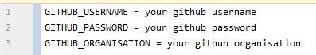
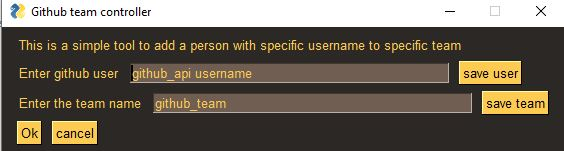

# github-manager
A small and useful software with good looking UI that allows you to manage github users within your organisation, using GitHub api.

# Setup
In order for this software to run you need to fill the .env file with your credencials and name of the organisation you want to use
  
# Adding a person to github
  
Type in an user username and click save to save the ID,  
Type your team name and click to save the ID
Press OK to add  
# Requirements
requests  
python-dotenv  
PySimpleGUI  
